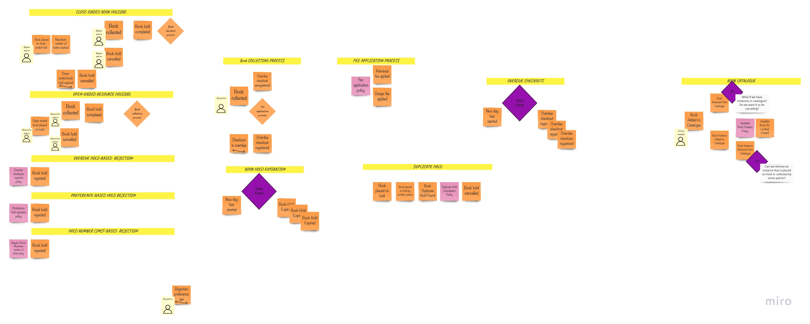
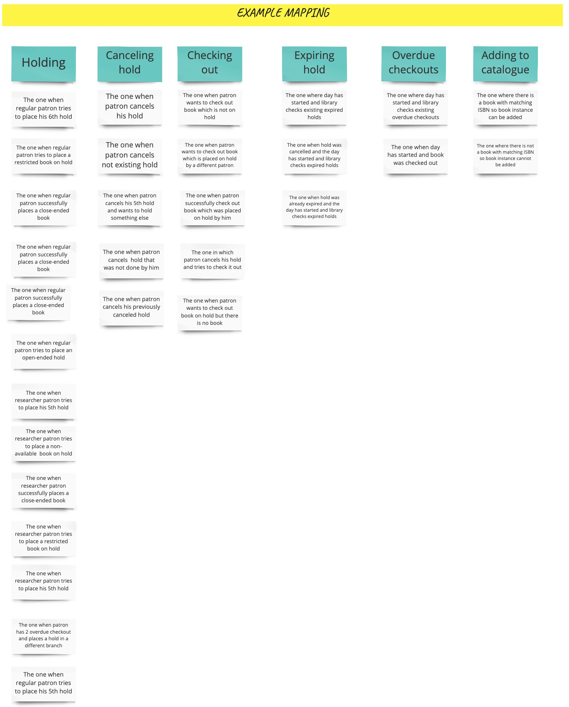

## About

This is a project of a library, driven by real [business requirements](#domain-description).
We use techniques strongly connected with Domain Driven Design, Behavior-Driven Development,
Event Storming, User Story Mapping. 

## Domain description

A public library allows patrons to place books on hold at its various library branches.
Available books can be placed on hold only by one patron at any given point in time.
Books are either circulating or restricted, and can have retrieval or usage fees.
A restricted book can only be held by a researcher patron. A regular patron is limited
to five holds at any given moment, while a researcher patron is allowed an unlimited number
of holds. An open-ended book hold is active until the patron checks out the book, at which time it
is completed. A closed-ended book hold that is not completed within a fixed number of 
days after it was requested will expire. This check is done at the beginning of a day by 
taking a look at daily sheet with expiring holds. Only a researcher patron can request
an open-ended hold duration. Any patron with more than two overdue checkouts at a library
branch will get a rejection if trying a hold at that same library branch. A book can be
checked out for up to 60 days. Check for overdue checkouts is done by taking a look at
daily sheet with overdue checkouts. Patron interacts with his/her current holds, checkouts, etc.
by taking a look at patron profile. Patron profile looks like a daily sheet, but the
information there is limited to one patron and is not necessarily daily. Currently a
patron can see current holds (not canceled nor expired) and current checkouts (including overdue).
Also, he/she is able to hold a book and cancel a hold.

How actually a patron knows which books are there to lend? Library has its catalogue of
books where books are added together with their specific instances. A specific book
instance of a book can be added only if there is book with matching ISBN already in
the catalogue.  Book must have non-empty title and price. At the time of adding an instance
we decide whether it will be Circulating or Restricted. This enables
us to have book with same ISBN as circulated and restricted at the same time (for instance,
there is a book signed by the author that we want to keep as Restricted)

## General assumptions

### Process discovery

The first thing we started with was domain exploration with the help of Big Picture EventStorming.
The description you found in the previous chapter, landed on our virtual wall:    
   
The EventStorming session led us to numerous discoveries, modeled with the sticky notes:  
   
During the session we discovered following definitions:  
    

This made us think of real life scenarios that might happen. We discovered them described with the help of
the **Example mapping**:  
  

This in turn became the base for our *Design Level* sessions, where we analyzed each example:  
  

Please follow the links below to get more details on each of the mentioned steps:
- [Big Picture EventStorming](./docs/big-picture.md)
- [Example Mapping](docs/example-mapping.md)
- [Design Level EventStorming](docs/design-level.md)
